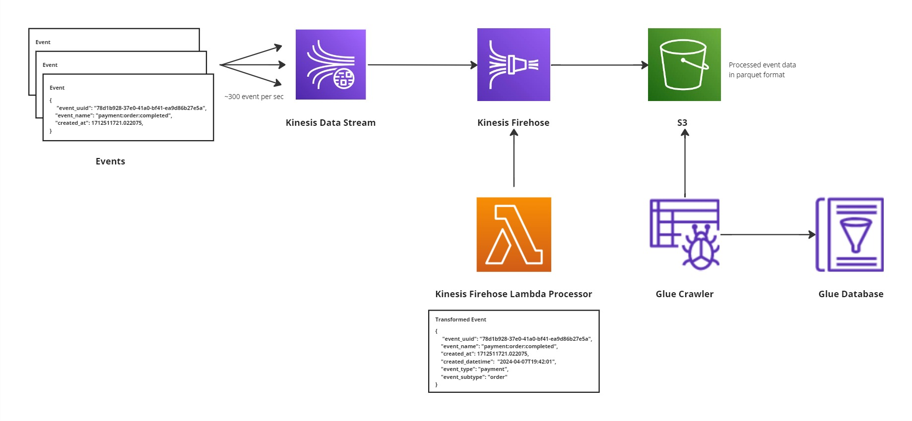

# Developer handbook
1. [ Requirements and setup ](#requirements-and-setup)
2. [ Design Documentation ](#design-documentation)
3. [ Design Questions ](#design-questions)

## Requirements and setup

### How to prepare local project environment
#### Prerequisites
* docker >= 20.10.24
* docker-compose
* terraform
* tflint
#### Linux (Ubuntu/Debian)

Run all the commands under the kinesis_streams_demo folder:
```
cd kinesis_streams_demo
```
1. Add custom ppa and install python 3.11:

    ```
    sudo add-apt-repository ppa:deadsnakes/ppa
    sudo apt-get update
    sudo apt-get install python3.11 python3.11-dev python3.11-venv
    alias python3=python3.11
    ```

2. Create virtual environment for local development:

    ```
    python3 -m venv $CUSTOM_DIRECTORY
    ```

3. Activate virtual environment and install dependencies.

    ```
    source $CUSTOM_DIRECTORY/bin/activate
    make install_dev
    ```

4. Launch localstack

    ```
    export LOCALSTACK_AUTH_TOKEN=<YOUR_AUTH_TOKEN> #pro version or trial of localstack necessary for glue catalog creation
    make launch_localstack
    ```

5. Initialize and apply terraform configuration

    ```
    make terraform_dev
    ```
    
    You can execute aws cli commands to check the infrastructure components. For example belofollowingw command lists the s3 buckets in localstack env.

    ```
    aws --endpoint-url=http://localhost:4566 s3 ls
    ```
    
    or list kinesis strems by following command:
    ```
    aws --endpoint-url=http://localhost:4566 --region eu-west-1 kinesis list-streams
    ```

6. Run producer to stream data into kinesis:
    ```
    python app/producer/event_producer.py
    ```
    It will get required aws secrets, kinesis stream name etc. (Cf. [here](app/producer/event_producer.py)) from environment variables.
    If you are not using default values, run it by using following command:

    ```
    AWS_REGION="<YOUR_REGION>" AWS_ACCESS_KEY="<YOUR_ACCESS_KEY>" AWS_SECRET_KEY="<YOUR_AWS_SECRET_KEY>" KINESIS_ENDPOINT="<YOUR_KINESIS_ENDPOINT>" KINESIS_STREAM_NAME="<YOUR_KINESIS_STREAM_NAME>" LOG_LEVEL="<YOUR_LOG_LEVEL>" python app/producer/event_producer.py
    ```

7. Checked processed data from s3 bucket
    
    Change the s3 path accordingly.

    ```
    aws --endpoint-url=http://localhost:4566 s3 ls aws --endpoint-url=http://localhost:4566  s3 ls s3://dev-demo-event-stream-data-eu-west-1-000000000000/event-streams/data/2024/04/07/18/
    ```

#### Windows
TODO

#### iOS
TODO

## Design Documentation

This documentation outlines the high level architecture for event streaming application demo by using AWS services Kinesis Data Stream, Kinesis Firehose, Lambda, S3 and Glue. As a start point of the streaming pipeline Kinesis Data Stream ingest event data and Kinesis Firehose reads data from Kinesis Data Stream. Kinesis Firehose transform event data and add aditional fields via AWS Lambda Function and before write data into S3 Kinesis Firehose convert json data to parquet format and does partitioning in order to provide effective query performance. Finally Glue Crawler automatically explore the data structures and create data catalog for the S3 data. Created a Glue database acts as a library of the event data, ready for querying and analysis.

### Architecture Components
#### Kinesis Data Stream
The first step in the pipeline is Kinesis Data Stream. Kinesis Data Stream is an AWS service and serverless that can handle huge amount of writes and reads per second. All the records are persisted for 24 hours (can be extended up to 365 days). It is highly reliable and provides enough time to process the data even within peak hours.

Mechanism for scaling in Kinesis Data Stream is sharding. With one shard stream can handle 1000 writes/second. For this demo application 4 shards with provisioned capacity mode have been configured in order to process 1M events/hour (~300 events/sec) with event size ~300bytes. This configuration can handle the peak times and provide low cost (Cf. [shard calculator](https://comcastsamples.github.io/KinesisShardCalculator/)). In Kinesis Data Stream partition key is used to distribute load between the shards. In this demo application grouping for the events by shard is not neccessary, so unique event key of the input data has been used to uniformly distribute data between the shard.

To send events to Kinesis Data Stream [event_producer.py](app/producer/event_producer.py) script has been used.

#### Kinesis Firehose & Lambda
Kinesis Firehose and Lambda have been used as a second step to read data and send it to S3 datalake. Lambda is a hosted technology which is basically a function that takes some piece of input and then processes it and sends it forward. Amazon can run these functions in parallel as many as needed to process the data in real time fashion.

In this demo application Kinesis Firehose configured to use Lambda to transform the event data with default buffer size 5Mb and buffer interval 300sec. Every time we get 5MB of data or every 300sec to Kinesis Firehose, lambda function is launched with those events as an input. Lambda function’s job is to process the event data and add additional fields and prepare the partition keys for the data. Then Firehose convert the proccessed event data to parquet format and writes to S3 bucket according to partition keys. In this demo application Firehose has been used, because it does all the bulk work related to S3; buffering for writing reasonable sized files, creating folder structure based on time and gzipping them. It is highly scalable, easy to use and aws managed serverless service.

#### S3
The processed event data stored in the S3 datalake securely and easily accessible when needed. Amazon S3 is known for its scalability, security, and durability, making it the perfect choice to house datalake.

#### Glue Crawler and Database
To make sense of the troves of data stored in the S3 datalake Glue Crawler and Database have been used. Glue Crawler is like an explorer, automatically discovering the hidden treasures, deciphering the structure, and cataloging it. It then creates a Glue database that acts as a library of your data, ready for querying and analysis.




## Design Questions

#### How would you handle duplicate events?
Data duplication can happen due to the producer retries or consumer retries or just simply sending same event multiple times. In the event data of the demo application each event has unique id 'event_uuid' which provide uniqueness to the events. Producer and consumer retries can be handled in the consumer or producer applications by using the help of the unique id, but it can be tricky to handle data duplication in producer or consumer. I would prefer to handle data duplication by using following approaches:
* Glue ETL Approach: Running a seperate Glue ETL job which deletes the duplicates regularly.
* Redsihft approach: Load event data into a redshift temporary staging table and then perform a modified merge operation to remove duplicates. 

#### How would you partition the data to ensure good querying performance and scalability?
The event data contains ~100 different types of events, but the cardinality of the events can be various. For example account creation and deletion probably have lower event than lesson started/finished events. After consideration of this information and the event traffic partitioning by year,month,day and hour according to creation date of the data has been used. This approach can split the data more uniformly between the partitions and provide better query performance.

#### What format would you use to store the data?
Parquet format has been used to store the data in s3. Parquet is a columnar storage format and provide good compession for the data. These features of the parquet provides good query performance for the analytics queries and decrease the stored data size.

#### How would you test the different components of your proposed architecture?
Unit tests for the application code has been written to test application code like lambda etc. Unit tests can be written also for terraform code. In In order to validate the combination of inputs and surface the errors of terraform code, contract tests has been provided. Unit tests and contract test can be easily executable by using the makefile. Also by help of the localstack and pytest the behavior of the individual components or modules separately and ensure the it’s working as expected before integrating it into a large system. Localstack is a open-source tool that can be used to populate cloud services locally without connecting to a remote cloud provider. It alleviates the challenge of testing and debugging cloud services without a separate cloud environment and minimises testing costs. The required cloud service environment can be simulated using localstack and it supports wide range of cloud services including S3, lambda, SQS, SNS, SES, RDS, Kinesis, DynamoDB etc.

#### How would you ensure the architecture deployed can be replicable across environments?
Application architecture has been created by using terraform from local environment (localstack) to staging and prod environments. In terraform code common parts of the architecture have been places into common modules and environment related code just contains the required variables like bucket name, stream name etc. for hat specific environment. This structure provide easy replication of the application in each environment and also makes local development easy.

#### Would your proposed solution still be the same if the amount of events is 1000 times smaller or bigger?
In case of higher or lower event traffic, proposed solution can be scaled up and down easily by monitoring the cloudwatch metrics of the Kinesis. When these events catched by the cloudwatch alarm, application components can be scaled up/down. Also all the components of the architecture are serverless aws manages services, hence another approach can be leave scaling up/down to aws for example by using on-demand provisioned option of the Kinesis Data Stream.

#### Would your proposed solution still be the same if adding fields / transforming the data is no longer needed?
Proposed solution can be still used by discarding the lambda function, if data transformation of the data is not necessary. Terraform code already does the parquet conversion and partitioning.

## TODOs 
* Security: IAMs, data encryption & KMS, VPC
* Monitoring: Clodwatch metrics, logs, dashboard
* Kinesis: Scalability, error handling, backup etc.
