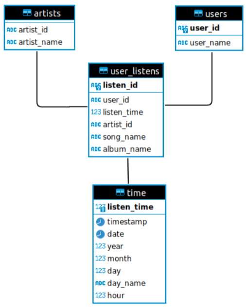

# Developer handbook
1. [ How to prepare local environment ](#how-to-prepare-local-environment)
1. [ Database Schema ](#database-schema)
1. [ Useful Commands ](#useful-commands)

## How to prepare local environment

Run the following commands under the project folder:
```
cd music_listening_analysis_demo
```
1. Add custom ppa and install python 3.11:

    For Linux
    ```
    sudo add-apt-repository ppa:deadsnakes/ppa
    sudo apt-get update
    sudo apt-get install python3.11 python3.11-dev python3.11-venv
    alias python=python3.11
    ```

    For OSX
    ```
    brew install python
    ```

2. Create virtual environment for local development:

    ```
    python -m venv $CUSTOM_DIRECTORY
    ```

3. Activate virtual environment and install dependencies.

    ```
    source $CUSTOM_DIRECTORY/bin/activate
    make install_dev
    ```

4. Run etl job. 
    ```
    PYTHONPATH=$PYTHONPATH:$(pwd)/app DB_NAME=<YOUR_DB_NAME> python app/etl.py <YOUR_DATA_FILE_PATH>
    ```

    For example fllowing command creates a database named "demo" by using the data of the "data/dataset.zip" input file.
    ```
    PYTHONPATH=$PYTHONPATH:$(pwd)/app DB_NAME=demo python app/etl.py data/dataset.zip
    ```

5. Run alaysis via [notebook](analysis.ipynb)
    
## Database Schema


## Useful Commands
* Run unit tests
    ```
    make run_tests
    ```

* Format code
    ```
    make format_code
    ```

* Run style checks
    ```
    make check_code_style
    ```